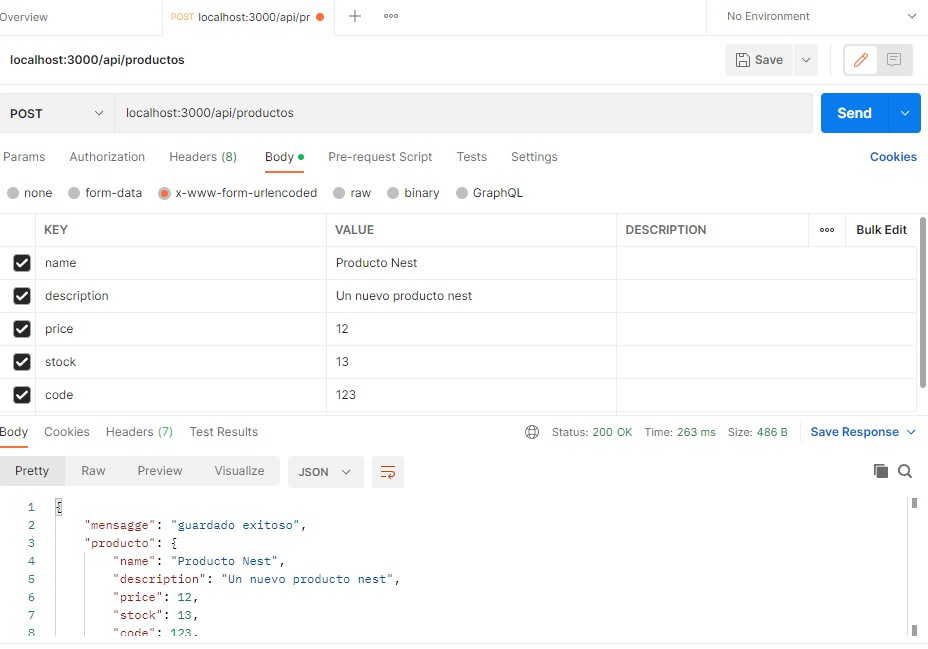
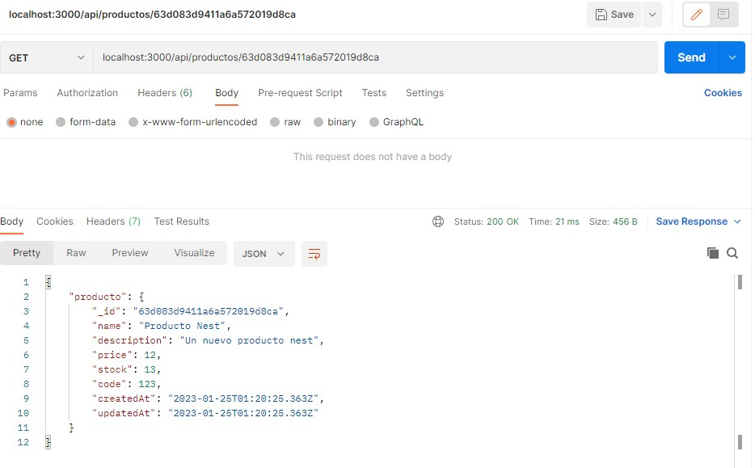
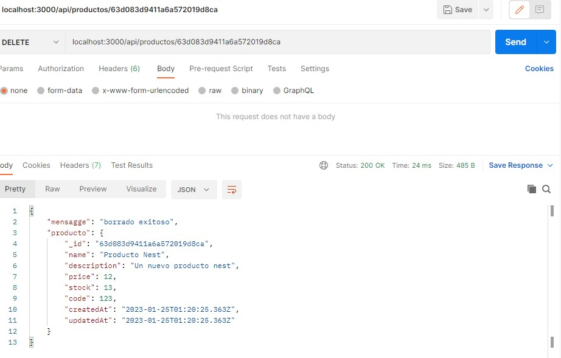

# **Desafío: **Reformar para usar otro framework****. Curso CoderHouse Backend Node.Js

## Consignas:

Elegir uno de los frameworks vistos en clase y trasladar a esta nueva plataforma el último proyecto entregable (con GraphQL) o al anterior (sin GraphQL).

Verificar el correcto funcionamiento del servidor a nivel de sus rutas, vistas, lógica de negocio y persistencia.

## Running the app

```bash
# development
$ npm run start

# watch mode
$ npm run start:dev

# production mode
$ npm run start:pro
```

## Probar la API

Se puede probar la API en la ruta: localhost:3000/api/productos. Se recomienda utilizar [Postman](https://www.postman.com/downloads/)

## Resultados:






